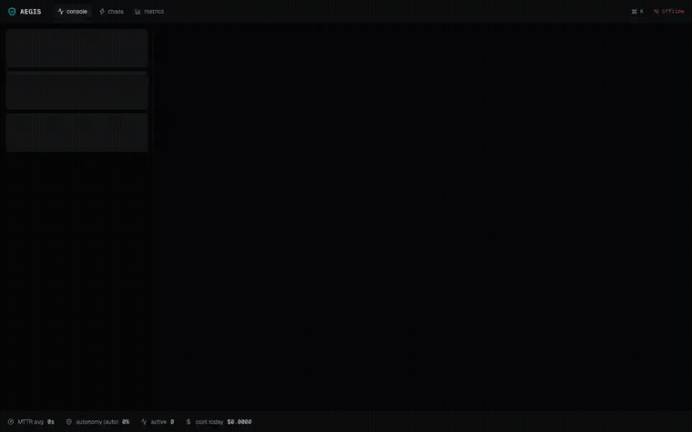

# AEGIS



AEGIS is a self-healing incident operations platform. It watches a real
three-service demo system, detects injected faults with a plain rules
engine, diagnoses them with a team of LLM agents reading live traces and
logs, fixes low-risk problems on its own, routes risky fixes through a
signed human approval, verifies the result, and replays every decision in
a flight-recorder UI. Most self-healing demos sell the resolution; AEGIS
sells the proof of resolution: a hash-chained event log, signed
approvals, and a regulator-styled evidence pack for anything it touched.

## Measured results

Three live runs per scenario against the real Groq API (`MOCK_LLM=0`),
numbers pasted from [docs/reports/PHASE_6_REPORT.md](docs/reports/PHASE_6_REPORT.md).
`cache_outage` has one clean sample; see that report for why (a shared
free-tier daily token quota ran out mid-collection, twice, documented
there rather than hidden here).

| Scenario           | Autonomy | MTTR (avg) | Cost/incident (avg) | Action                     |
| ------------------ | -------- | ---------- | ------------------- | -------------------------- |
| latency            | auto     | 92s        | $0.0025             | `remove_toxic` (green)     |
| crash              | auto     | 61s        | $0.0015             | `restart_service` (green)  |
| error_spike        | auto     | 132s       | $0.0030             | `rollback_config` (yellow) |
| memory_leak        | auto     | 21s        | $0.0019             | `restart_service` (green)  |
| cache_outage (n=1) | auto     | 136s       | $0.0023             | `remove_toxic` (green)     |

Fixture runs (`MOCK_LLM=1`, deterministic, no API key) heal all five
scenarios in well under a minute each; that's the mode CI and the
quickstart below run on.

## Quickstart

No API key, offline, deterministic (`MOCK_LLM=1` is the `.env.example`
default):

```
git clone https://github.com/Naresh23032003/AEGIS.git
cd AEGIS
cp .env.example .env
make up
```

Requires Docker and Python 3.12. `make up` provisions its own `.venv` and
npm workspace deps on first run, builds the stack, and brings every
container up healthy, typically inside 2 minutes on a warm build cache.
Open <http://localhost:3000>, go to **chaos**, and press **inject fault**
on the **latency** card. The console screen takes over from there: the
topology reacts, an incident card appears once detection fires (about 50s,
the PromQL window), and it resolves on its own. `make down` tears it down.

Live LLM path (real Groq calls, needs a free API key from
[console.groq.com](https://console.groq.com)):

```
# in .env: set GROQ_API_KEY, MOCK_LLM=0
make up
```

## Architecture

See [docs/architecture.md](docs/architecture.md) for the full diagram and
a paragraph per layer, and [docs/adr/](docs/adr/) for the eight decisions
behind it (checkpoints over Temporal, a closed action catalog, browser-held
approval keys, and so on).

Short version: a rules engine detects; a LangGraph agent loop (triage,
diagnose, plan, act, verify) diagnoses and proposes from a closed action
catalog; OPA gates every proposal by tier (green executes, yellow opens a
veto window, red blocks on a signed approval); a single process holding
the Docker socket executes; every step is a hash-chained event, streamed
live to the console and replayable after the fact.

## Security model

- **Closed action catalog.** Agents choose a `catalog_key` from a fixed,
  typed list (`apps/core/aegis/actions/catalog.yaml`); there is no path
  from an LLM response to a shell command. The executor never imports LLM
  code.
- **Policy gate on every action.** OPA (`packages/policies/aegis.rego`)
  evaluates tier, confidence, and severity before anything runs. A
  below-confidence proposal is denied and the incident escalates to a
  human rather than guessing; this happens for real in the measured runs
  above, not just in tests.
- **Signed human decisions.** Approvals and vetoes are Ed25519-signed in
  the browser; the server verifies but never holds a key that could forge
  one.
- **Hash-chained audit log.** Every event is `sha256(prev_hash ||
canonical_json(envelope))`, written in the same transaction as the row
  it describes. `GET /api/incidents/{id}/verify-chain` recomputes it;
  tampering with a stored event is detectable.
- **Evidence pack.** `GET /api/incidents/{id}/evidence-pack` returns a zip
  of a regulator-styled PDF (full timeline, every policy decision and rule
  id, every signed approval/veto, chain verification result, agent runs
  and cost) plus `events.jsonl`, sections subtitled with the EU AI Act
  articles they map to (12: record-keeping, 14: human oversight, 73:
  serious incident report draft). No compliance claim is made; high-risk
  obligations under the Act apply from December 2027 (Digital Omnibus
  deferral) and this demonstrates the runtime evidence shape early, not
  certification.

## What this is not

A production incident-response system. The demo scale is one docker-compose
host, a fixed five-scenario chaos catalog, and a free-tier LLM key with a
daily quota this project comfortably exhausted while collecting the numbers
above. The production path items (Kubernetes executor, Temporal, WebAuthn
approvals, a larger action catalog) are tracked as GitHub issues, not
built here. `MOCK_LLM=1` exists so the demo and CI never depend on a live
model at all.

## Layout

See [plan/01-architecture.md](plan/01-architecture.md) for the full monorepo
layout and locked stack. Summary: `apps/console` (Next.js), `apps/core`
(FastAPI api/worker/executor), `apps/target` (the demo system that gets
broken and healed), `packages/contracts` (JSON Schema source of truth),
`packages/policies` (OPA/Rego), `deploy/` (compose stack).

## Development

```
make lint test     # ruff + mypy + eslint + prettier + pytest + opa test
make e2e            # scenario suite against a running stack (make up first)
make e2e-live        # same, with MOCK_LLM=0 in .env
```

This repo was built from the specification in [PLAN.md](PLAN.md) and
[plan/](plan/), one phase at a time; each phase's report is in
[docs/reports/](docs/reports/).
