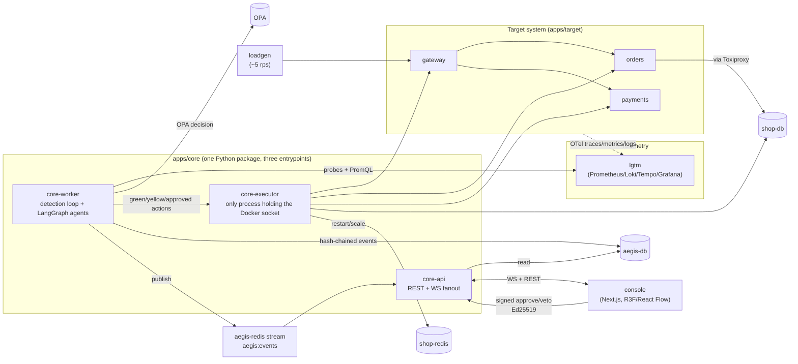

# Architecture

AEGIS is a closed loop: a demo e-commerce system that breaks on command, a
detection and diagnosis loop that watches it, a small closed catalog of
remediation actions gated by policy and human sign-off, and a console that
renders and replays every decision. This document is the diagram and the
prose; the decisions behind each box are recorded as ADRs in
[docs/adr/](adr/).

## Diagram

## Layers

**Target system** (apps/target: gateway, orders, payments). A small,
realistic three-service checkout path, not a toy. orders reaches its
Postgres only through Toxiproxy, so network-level faults (latency,
dropped connections) are real network conditions, not simulated flags;
payments carries the two app-level fault endpoints (error rate, memory
leak) that a proxy can't produce on its own. loadgen keeps a steady ~5rps
of realistic traffic against the gateway so every fault shows up in
traces and metrics the same way a real incident would.

**Telemetry** (lgtm: Prometheus, Loki, Tempo, Grafana in one container).
Every target service exports OTel traces, metrics, and logs here.
Detection reads Prometheus over PromQL; diagnosis tools read all three.
One container instead of separately-operated pieces because at demo
scale the operational cost of running them apart buys nothing.

**Detection and diagnosis** (core-worker). Detection is a plain rules
engine (`aegis/detection/rules.yaml`, PromQL thresholds and health
probes) on a 5-second poll, not an LLM: it has to be cheap and
deterministic. Diagnosis is where the LLM earns its keep, one LangGraph
graph per incident (triage → diagnose → plan → act → verify, looping
back to diagnose up to 3 times) with Postgres-backed checkpointing so a
killed worker resumes an in-flight run instead of losing it. See
[ADR-001](adr/ADR-001-langgraph-postgres-checkpoints.md) (checkpoints
over a second orchestrator) and
[ADR-004](adr/ADR-004-rule-based-detection-llm-diagnosis.md)
(rule-based detection, LLM diagnosis).

**Action catalog and policy** (`aegis/actions/catalog.yaml`, OPA). Agents
never emit shell commands or free-form instructions to the executor; they
choose a `catalog_key` from a fixed, typed list, each mapped in
`aegis/actions/execute.py` to one hardcoded Docker-SDK or HTTP call. Every
proposal is evaluated against OPA (`packages/policies/aegis.rego`) before
anything runs: green tier executes immediately, yellow tier opens a
30-second veto window, red tier blocks on a signed human approval. See
[ADR-005](adr/ADR-005-closed-action-catalog.md) (closed catalog) and
[ADR-002](adr/ADR-002-executor-allowlist-not-gvisor.md) (allowlist over
gVisor, so the one-command demo still runs on macOS).

**Executor** (core-executor). The only process in the system with the
Docker socket mounted. It never imports LLM code, by construction, so a
prompt-injected log line has no path to a shell. Diagnosis tool output
that reaches the LLM is always quarantine-wrapped first.

**Event log** (aegis-db). Every state change is an event, hash-chained
(`sha256(prev_hash || canonical_json(envelope))`, first link keyed off
the incident id) and written inside the same transaction as whatever row
it describes, then published on a Redis stream for live fan-out. See
[ADR-003](adr/ADR-003-redis-streams-not-kafka.md) (Streams over
Kafka/NATS at this scale). The evidence pack
(`GET /api/incidents/{id}/evidence-pack`) and `verify-chain` both read
this log; nothing about it is reconstructed from memory.

**Console** (apps/console). One WebSocket-fed Zustand store is the only
source of live data; every screen selects from it. The topology renders
in React Three Fiber by default, falling back to a 2D React Flow graph on
reduced motion, a failed WebGL feature-detect, or `?view=2d`, both
reading the same `useTopologyState()` hook so they can't drift. See
[ADR-008](adr/ADR-008-r3f-with-2d-fallback.md). Approvals and vetoes are
signed with an Ed25519 key held in the browser
([ADR-006](adr/ADR-006-browser-held-ed25519-keys.md)): the server
verifies signatures but never holds a key that could forge one.

**Offline demo mode** (`MOCK_LLM=1`). Every LLM call goes through
`aegis.llm`, which in mock mode replays a recorded fixture for the given
scenario and node instead of calling Groq. Fixtures are recorded once,
live, per scenario (`make record-fixtures SCENARIO=x`). This is the
default so the whole demo, including CI, runs deterministically with no
API key. See [ADR-007](adr/ADR-007-recorded-llm-fixtures.md).

## What ties it together

One incident, start to finish: loadgen traffic hits a fault; core-worker's
rules engine detects it inside its 5s poll, opens an incident, and starts
a LangGraph run; the run diagnoses against live traces/logs/metrics,
proposes an action from the closed catalog, clears OPA, and either
executes immediately (green), waits out a veto window (yellow), or blocks
on a signed approval (red); the executor makes the real change; verify
re-probes and either closes the incident with a measured MTTR or loops
back. Every step along the way is an event, chained and streamed, and the
console renders and later replays every one of them.
